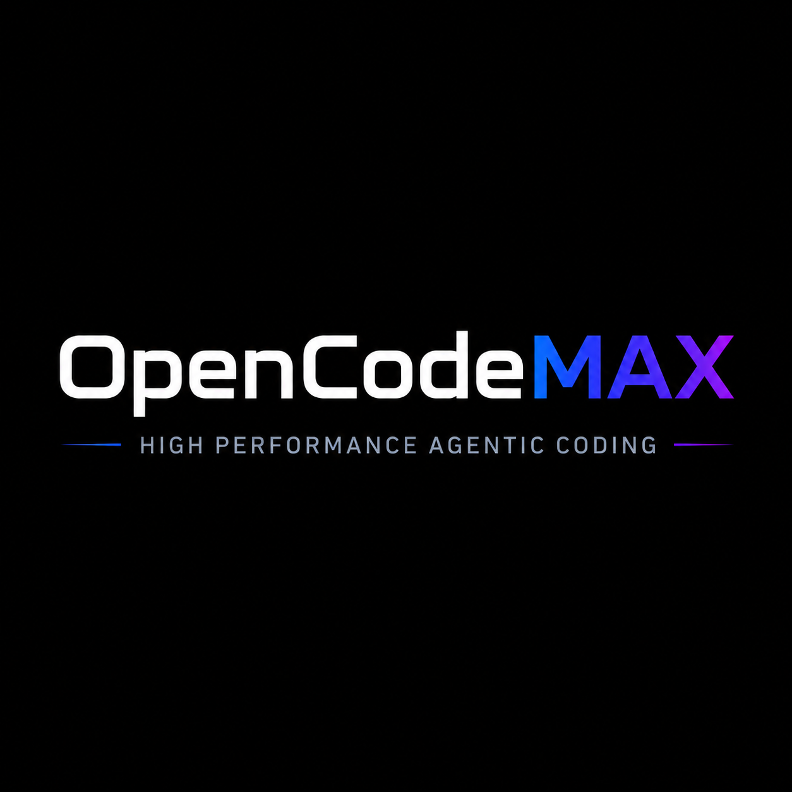

# OpenCodeMAX

<p align="center">
  
</p>

OpenCodeMAX is a fork of [OpenCode](https://github.com/anomalyco/opencode) focused on higher-agentic-performance terminal coding.

It keeps upstream OpenCode package and build compatibility, so the command is still `opencode`, but this fork publishes GitHub Release assets as `OpenCodeMAX-*`.

This project is not affiliated with the upstream OpenCode team.

## What This Fork Adds

OpenCodeMAX is optimized for bigger, messier coding tasks where one linear chat loop is not enough.

- **Persistent objectives with `/goal`**: give the agent a long-running mission and it will keep future turns anchored to that outcome, including token-budget awareness and goal status.
- **Inline side quests with `/btw`**: ask tangential questions or spin off quick discussions without opening a separate session or derailing the main task.
- **Parallel implementation swarms**: launch local background subagents that can inspect code, edit files, run commands, test, and report back independently.
- **Team coordination primitives**: named worker teams, shared task boards, assignment, dependency tracking, broadcast messages, peer messaging, scheduled follow-ups, and worker transcript controls.
- **High-throughput autonomous mode**: child workers can inherit permissive YOLO-style behavior for trusted sessions instead of blocking on master approval for every routine edit or command.
- **Local-first reliability**: subagents default to local execution so swarms work out of the box without requiring a remote worker backend.
- **Operator visibility**: inspect running workers, read outputs, view transcripts, stop/cancel tasks, and manage panes from the terminal UI or CLI.

## Install

Install from the GitHub Release:

```bash
curl -fsSL https://github.com/patrick-toulme/opencode/releases/latest/download/install.sh | bash
```

By default this installs the `opencode` binary to `~/.local/bin`. Override the install directory with:

```bash
curl -fsSL https://github.com/patrick-toulme/opencode/releases/latest/download/install.sh | OPENCODEMAX_INSTALL_DIR=/usr/local/bin bash
```

You can also download a platform archive directly from the same release:

https://github.com/patrick-toulme/opencode/releases

- `OpenCodeMAX-darwin-arm64.zip`
- `OpenCodeMAX-darwin-x64.zip`
- `OpenCodeMAX-darwin-x64-baseline.zip`
- `OpenCodeMAX-linux-arm64.tar.gz`
- `OpenCodeMAX-linux-x64.tar.gz`
- `OpenCodeMAX-linux-x64-baseline.tar.gz`
- `OpenCodeMAX-linux-arm64-musl.tar.gz`
- `OpenCodeMAX-linux-x64-musl.tar.gz`
- `OpenCodeMAX-linux-x64-baseline-musl.tar.gz`
- `OpenCodeMAX-windows-arm64.zip`
- `OpenCodeMAX-windows-x64.zip`
- `OpenCodeMAX-windows-x64-baseline.zip`

## Run From Source

Requirements:

- Bun
- Git

```bash
bun install
bun run dev
```

To build the CLI locally:

```bash
bun run --cwd packages/opencode build --single
./packages/opencode/dist/opencode-*/bin/opencode --version
```

## Enable Goal Support

If your config uses feature flags, enable goals:

```toml
[features]
goals = true
```

## Upstream

This fork is based on OpenCode. Upstream documentation remains useful for provider setup, base configuration, and general CLI behavior:

https://opencode.ai/docs
